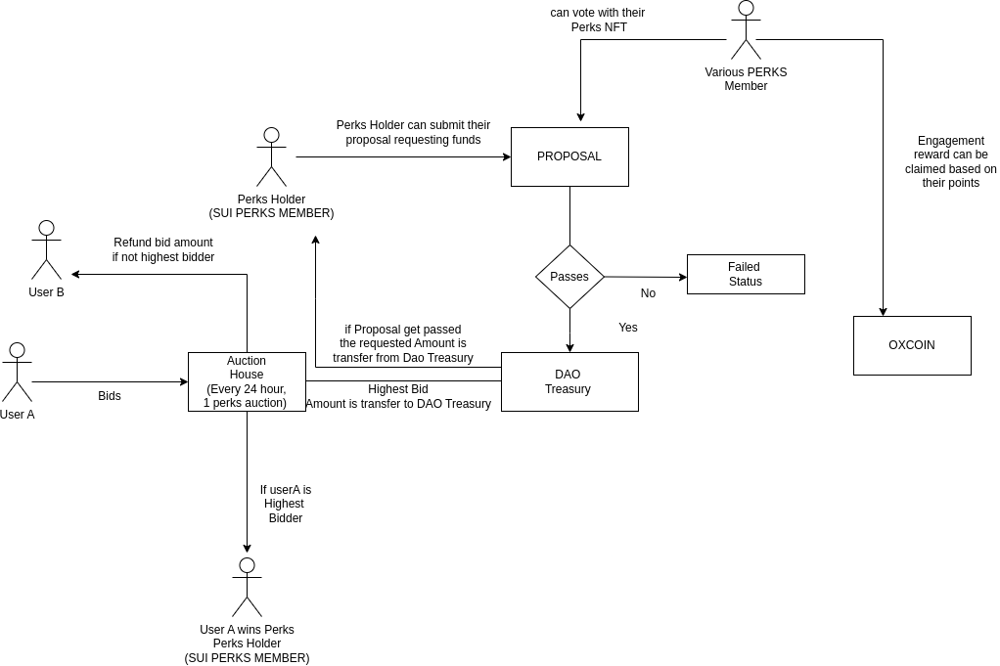

# SUI PERKS - daily perks for lifetime

## Overview

This project implements an Auction-based DAO smart contract system on the Sui Blockchain. A DAO, or Decentralized Autonomous Organization, is a mechanism that requires a certain voting threshold to agree on actions before they can be executed. Additionally, it features a perpetual auction where one PERK is auctioned every 24 hours. This adds a layer of security and is useful for controlling the DAO Treasury.

Utilizing the powerful paradigm of Objects in SUI and advanced move features such as Dynamic field, Dynamic Object Field, Transfer to object, and TimeCapsules, we see a lot of potential for this project to achieve our future goals. 

## Goals 

This project showcases daily auctions of one PERKS NFT for a lifetime, serving as an experiment to observe how on-chain communities can self-govern. To achieve this goal, the SUI PERKS retains the profits from the NFT auctions, which are then allocated for community proposals. Sui Perks acts as a community-based funding involving empowering a collective group  to allocate funds and resources towards shared goals. Through voting mechanism, the DAO treasury can be managed, allowing SUI PERKS community members to decide on fund allocation for charitable endeavours, internal operations, incubating startups, and developing the SUI PERKS intellectual property. This goals ensures democratic decision-making and fosters a dynamic ecosystem of innovation and collaboration.

## Future Enhancements

- **Artist Collaboration Platform:** This platform themes for artists to create NFTs, with a portion of the proceeds allocated to the creators. Artists are incentivized to contribute to the SUI PERKS through their artwork.

- **Mathematically Generated SVG Image for PERKS NFT ONCHAIN**:  Leveraging algorithms to generate unique PERKS with diverse traits directly on chain i.e `SVG to Base64` and stored nft itself onchain.

- **Sponsored Voting and Proposal Creation**: Allowing perks holder to sponser other users to vote or create proposals.

- **Installment Payments with Progress Reporting**: Enabling payments in installments, accompanied by progress updates

- **Sealed Bid Auction for Special NFT**: Introducing a secure and anonymous bidding for special PERKS NFT twice in a year 

## Features 

- **Daily Auction for LifeTime**:  The daily auction mechanism ensures consistent funding for the DAO treasury. The daily influx of funds also allows for controlled expansion of the DAO's governing membership, adding one new voter token each day. Regardless of when users become acquainted with SUI PERKS, the value of the NFT remains constant; whether it's known now or in the future, 1 PERKS equals 1 vote.

- **SUI PERKS NFT holders:** PERKS holders possess unique NFTs that grant them membership in the SUI PERKS, where each PERK equals one vote in the governance structure. SUI Perks holder can participate in decision-making by voting into proposal and can also submit their proposal into the community. 

- **DAO Treasury Management:** PERKS Holders can manage Flow of Treasury retains from the NFT auction.

- **Proposal:** To submit a proposal on-chain, users must hold PERKS NFTs. Proposing to the DAO involves joining a new community, presenting an idea, incubating it, seeking sponsorship, achieving community consensus, and more.

- **PERKS HOLDER Incentives:** Engagement isn't just valued at SUI PERKS—it's rewarded. SUI PERKS tracks the community engagement of each PERKS Holder and incentivizes them with PERKs Oxcoin, providing monthly points. A leaderboard of overall points is maintained for each period

## Modules

The project contains of several modules, each handling different aspect of the Auction and DAO functionality: 

1. **Auction**: The core module manages daily auctions and the treasury. It oversees the creation of PERKS NFTs every 24 hours, facilitates bidding to acquire the NFT, refunds the lowest bidder promptly upon a higher bid, and settles the auction. If no one bids on the NFT, it utilizes the Transfer to Object, Public Receving and Transfer policy for later user

2. **DAO**: The core module handles dynamic quorum votes, rates, and thresholds, while also overseeing the proposal state of each submission until completion. Additionally, it maintains engagement among PERKS HOLDERS and manages the status of proposal submissions. PERKS Holders can make decisions such as casting votes and submitting proposals.

3. **Treasury**: It holds the entire DAO Treasury amount in a DAO Treasury share object. Upon each 100% auction, the highest bidder's amount is directed to the DAO Treasury, which is overseen by the SUI PERKS community. The distribution of Treasury funds is transferred to the proposed recipient if the proposal passes. Upon passing, the necessary funds are deducted from the treasury and transferred to the proposal owner.

4. **OxCoin**: It manages the distribution of rewards to PERKS holders based on their engagement within the community. Essentially, PERKS holders can accrue points through various forms of engagement, including voting, submitting proposals, participating in discussions, and more. PERKS Holder can claim Perks Oxcoin token as reward. 

5. **PERKS OxNFT**: Handles the creation of PERKS OxNFT with daily themes. TO-DO on-chain OxNFT is generation with PERKS NFT Traits and weights randomly on chain.

## Flow & Architecture 

The Auction module defines the interface for creating, bidding on, and settling auctions. To become part of SUI PERKS, users participate by bidding on the NFT. The highest bidder wins the NFT, and the lowest bidder receives a refund of their amount. The highest bidder's amount is transferred to the treasury. The DAO module calculates dynamic quorum rates and thresholds, where the threshold is automatically determined based on the required amount for a proposal and the total balance in the treasury. Proposal status and interaction are maintained on-chain. PERKS holders are rewarded based on the points they have collected.

## Instructions for testing 

### Initial

1. Visit site  [https://suiperks-fe.onrender.com/](https://suiperks-fe.onrender.com/)
2. Connect the wallet with your peference 
3. If Auction is running  User can bid into the latest Running auction Highest bid will get the Perks NFT.

### Auction Duration and Testing

- The auction typically runs for 24 hours.
- For feasible testing purposes, the auction duration is set to 3 minutes.

### Auction Creation and Settlement

- Creating and settling an auction must be triggered manually for testing purposes.
- If an auction is currently running, no new auctions can be created until the current auction is settled.

### Bidding and Settling

- During an active auction, you can place bids to obtain the NFT.
- If the auction has ended, someone needs to trigger the settlement function.

### Testing Instructions

- For testing, please visit the following URL: [https://suiperks-fe.onrender.com/admin](https://suiperks-fe.onrender.com/admin).
- After settling the previous auction, you can create a new auction from the same URL. This will restart the auction process. this will be automate in future

### PERKS HOLDERS

- **Creating, Voting, and Claiming Rewards**
   - Create a proposal, vote on the proposal, and claim the oxcoin reward through engagement.

- **Proposal States**
   - **Initial**: Immediately after creating the auction, the proposal is in the `Initial` state.
   - **Active**: After a short period, the proposal becomes active. NFT holders can vote on proposals and make decisions during this state.
   - **Failed**: If the total votes do not meet the provided threshold, the proposal will be marked as failed.
   - **Queue**: If the proposal reaches votes above the provided threshold, it will move to the `Queue` state.
   - **Executed**: After being queued, the proposal is ready for execution. The required funds are transferred from the treasury balance.

### Engagement Rewards
- The engagement of every Perks holder is tracked. Based on this engagement, SUI PERKS members can claim their OXCOIN rewards every month within certain time constraints. These OXCOIN rewards have utility for further use.

### Published Contract [Testnet]

- **packageId**: [0xd57d07c950cc0afe318398479edf3e7f8a3f4475d60f080304323af6372105a5](https://suiscan.xyz/testnet/object/0xd57d07c950cc0afe318398479edf3e7f8a3f4475d60f080304323af6372105a5/txs)
- **AuctionDetails**: [0xd5041c59677148dc30026cecc37449f80b4c28b16bd70031a409a637aa812502](https://suiscan.xyz/testnet/object/0xd5041c59677148dc30026cecc37449f80b4c28b16bd70031a409a637aa812502)
- **DaoTreasury**: [0xbfdea87b0747cc3881be7140980cf46ed04a592ee94236b5a24603a67edf78fd](https://suiscan.xyz/testnet/object/0xbfdea87b0747cc3881be7140980cf46ed04a592ee94236b5a24603a67edf78fd)

